# Code Flowcharts for CMB Analysis Functions

This document contains flowcharts showing the actual execution flow of each Python module in the functions directory.

## Table of Contents
1. [correlation_function.py](#correlation_functionpy)
2. [cosmology.py](#cosmologypy)
3. [data.py](#datapy)
4. [maps.py](#mapspy)
5. [plots.py](#plotspy)
6. [s12.py](#s12py)
7. [simulation.py](#simulationpy)
8. [tools.py](#toolspy)
9. [xiv.py](#xivpy)

---

## correlation_function.py

### correlation_func(D_ell, xvals)
```mermaid
flowchart TD
    A[Start] --> B[Create array l = arange + 2]
    B --> C[Calculate fac2 = 2l+1 / 2l*l+1 * D_ell]
    C --> D[Vectorize Legendre: P l[:,None], xvals]
    D --> E[Multiply: fac2[:,None] * P result]
    E --> F[Sum along axis=0]
    F --> G[Return correlation array]
    G --> H[End]
```

### correlation_func_err(error, xvals)
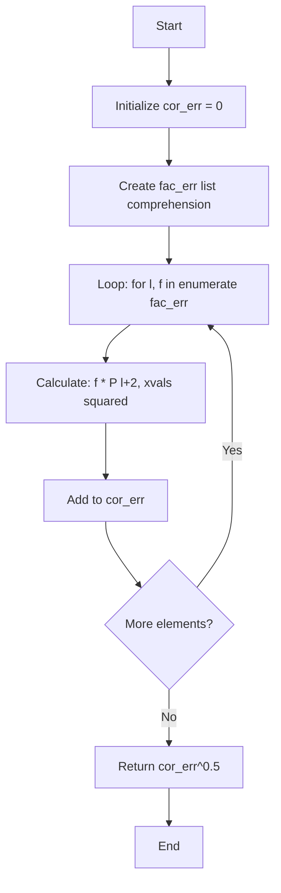

### correlation_func_err2(error, xvals)
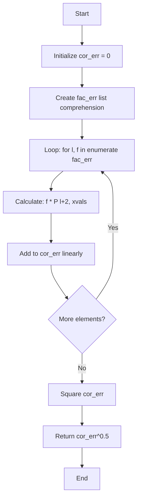

---

## cosmology.py

### compute_cl_cor_pl(parss, lmax, xvals)
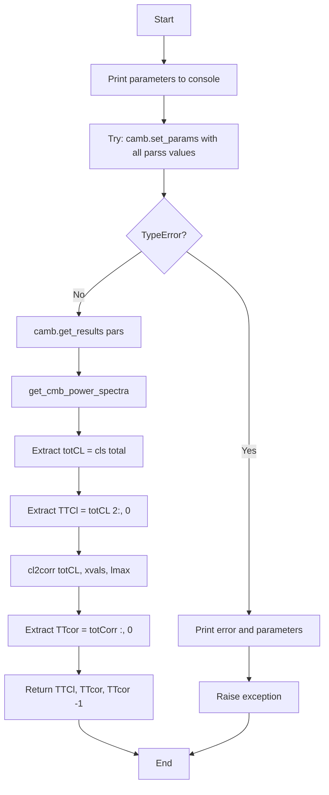

### compute_cl_cor_dv(parss, lmax, xvals)


### expand_dict_values(dict1, dict2)
```mermaid
flowchart TD
    A[Start] --> B[Get first_key from dict1]
    B --> C[target_length = len dict1 first_key]
    C --> D[Loop: for key, value in dict2.items]
    D --> E[Create list: value * target_length]
    E --> F{More items?}
    F -->|Yes| D
    F -->|No| G[Merge dict1 | expanded_dict2]
    G --> H[Return merged dict]
    H --> I[End]
```

### chain_calculations(parss, data_loader, intervals, c)
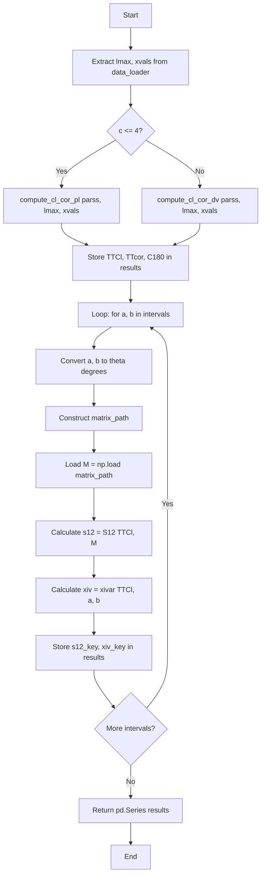

### chain_results(data_loader, intervals, roots, name, n)
```mermaid
flowchart TD
    A[Start] --> B[Extract xvals, lmax from data_loader]
    B --> C[Create chain_cols list]
    C --> D[Initialize data_dict = {}]
    D --> E[Loop: for i, root in enumerate roots]
    E --> F[Try: loadMCSamples file_root=root]
    F --> G[Print processing message]
    G --> H[Get params and fixed from samples]
    H --> I[Create chain_data dict]
    I --> J[expand_dict_values chain_data, fixed]
    J --> K[Create DataFrame, tail n]
    K --> L[Apply chain_calculations to each row]
    L --> M[Concat df and df_chain]
    M --> N[Stack D_ell and Cor arrays]
    N --> O[Calculate mean and std for Cl and Cor]
    O --> P[Extract short_name from root]
    P --> Q[Store in data_dict short_name]
    Q --> R{Exception?}
    R -->|Yes| S[Print error, continue]
    R -->|No| T{More roots?}
    S --> U[Finally: save data_dict to pickle]
    T -->|Yes| E
    T -->|No| U
    U --> V[End]
```

---

## data.py

### time_execution(func) decorator
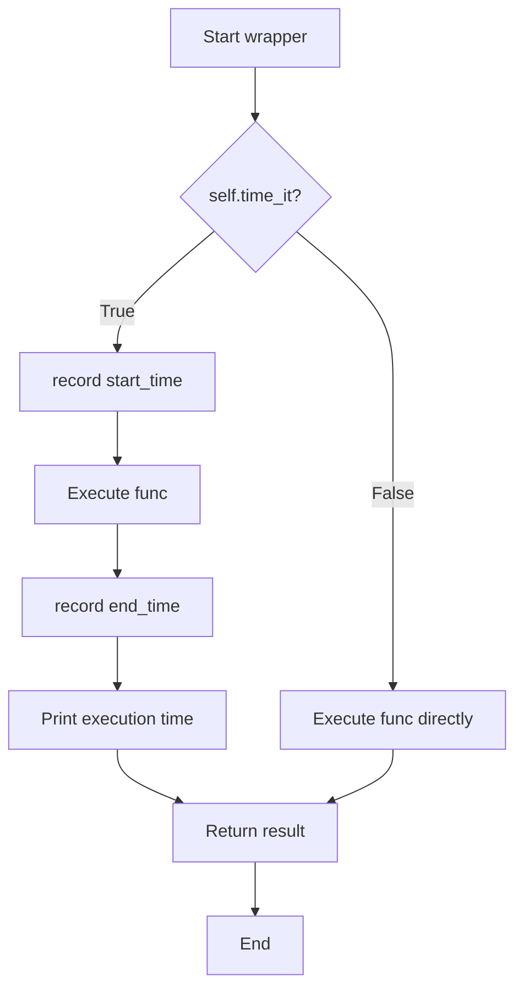

### Data_loader.__init__(path, lmax, n_xvals, time_it)
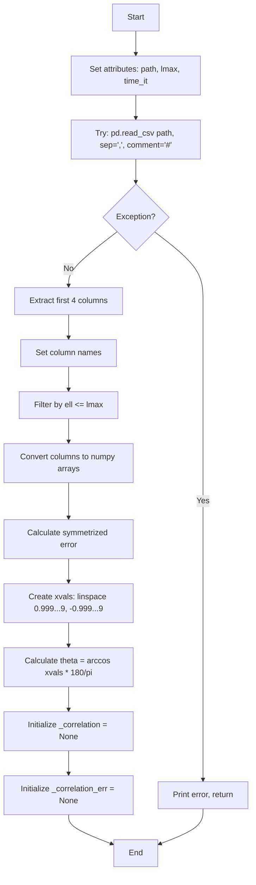

### Data_loader.get_correlation_function(force_recalc)
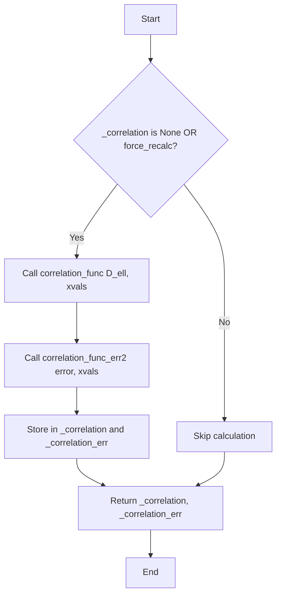

### Data_loader.get_xivar(a, b)
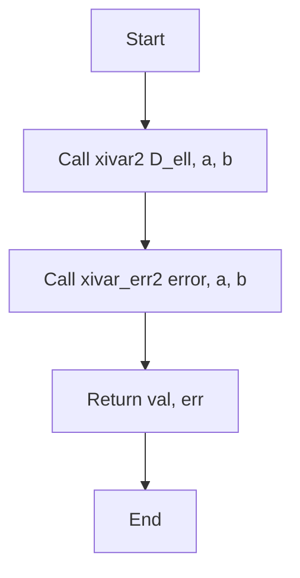

### Data_loader._load_matrix(a, b)
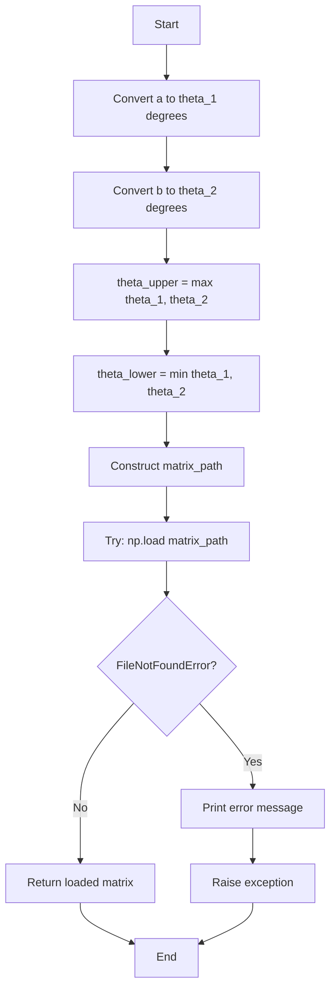

### Data_loader.get_s12(a, b)
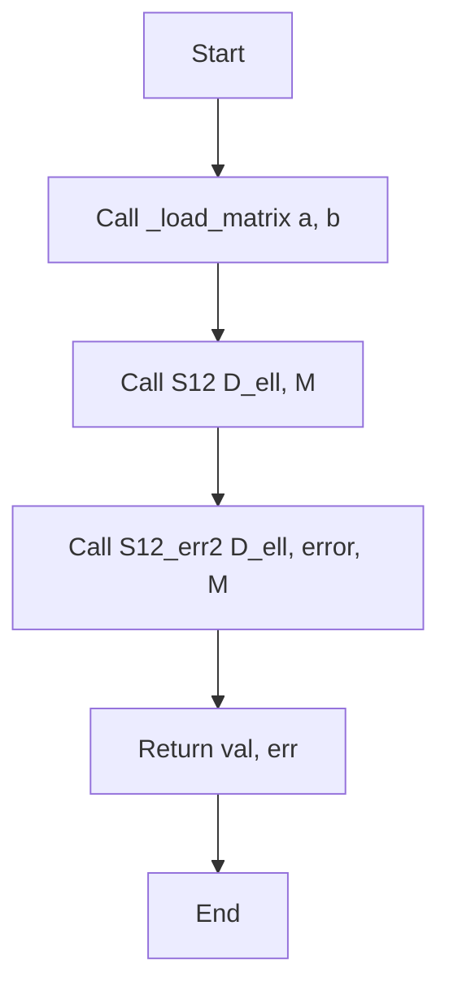

### Data_loader.experimental_values(intervals)
```mermaid
flowchart TD
    A[Start] --> B[Initialize exp_values = {}]
    B --> C[Call get_correlation_function]
    C --> D[Store C180 = corr -1, corr_err -1]
    D --> E[Initialize s12_values, xiv_values = {}]
    E --> F[Loop: for a, b in intervals]
    F --> G[Convert a, b to theta degrees]
    G --> H[Create s12_key, xiv_key]
    H --> I[Try: get_s12 a, b]
    I --> J{FileNotFoundError?}
    J -->|Yes| K[Store s12_key = NaN, NaN]
    J -->|No| L[Store s12_key = s12_val, s12_err]
    K --> M[Call get_xivar a, b]
    L --> M
    M --> N[Store xiv_key = xivar_val, xivar_err]
    N --> O{More intervals?}
    O -->|Yes| F
    O -->|No| P[Update exp_values with s12_values]
    P --> Q[Update exp_values with xiv_values]
    Q --> R[Return exp_values]
    R --> S[End]
```

---

## maps.py

### map_rot_refl(map_data)
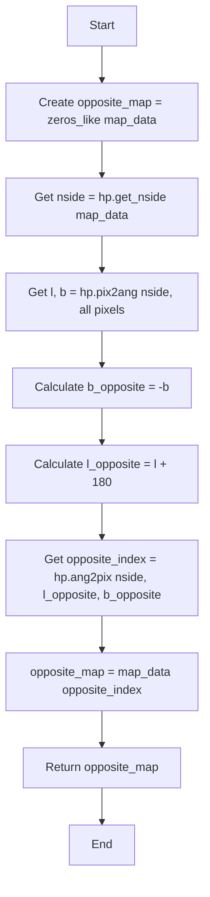

### estimate_coef(x, y)
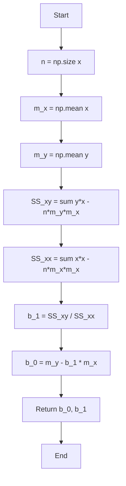

---

## plots.py

### _save_or_show_plot(save_path)
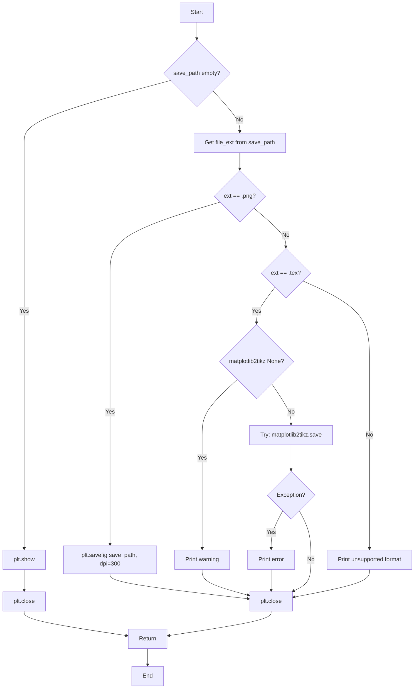

### MapPlots.plot180(map_data, opposite_map, map_name, save_path, lower)
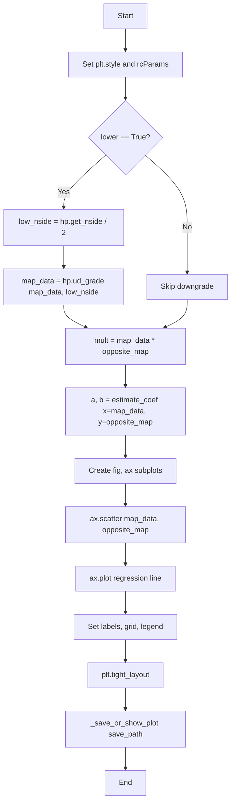

### MapPlots.map_contours(map_data, opposite_map, save_path)
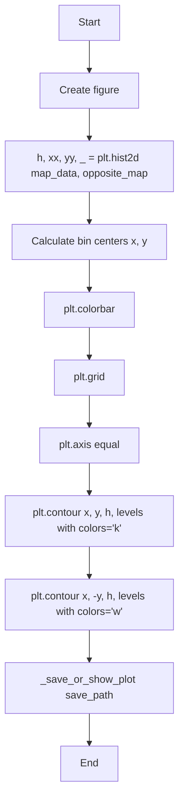

### CorrelationPlots.__init__(data_loader)
```mermaid
flowchart TD
    A[Start] --> B[self.DL = data_loader]
    B --> C[Call _apply_style]
    C --> D[End]
```

### CorrelationPlots._apply_style()
```mermaid
flowchart TD
    A[Start] --> B[plt.style.use seaborn-v0_8-paper]
    B --> C[Update rcParams: font.family, font.size, text.usetex]
    C --> D[End]
```

### CorrelationPlots._plot_statistic_interval(ax, interval, data_mean, data_err, model_mean, model_std, colors, data_symbol, model_label)
```mermaid
flowchart TD
    A[Start] --> B{colors is dict?}
    B -->|Yes| C[data_color = colors.get data]
    C --> D[model_color = colors.get model]
    B -->|No| E[data_color = colors 0]
    E --> F[model_color = colors 1]
    D --> G[Extract a, b from interval]
    F --> G
    G --> H[Convert a, b to degrees]
    H --> I[ax.fill_between theta range, data_mean ± data_err]
    I --> J[ax.plot data_mean horizontal line]
    J --> K[ax.fill_between theta range, model_mean ± model_std]
    K --> L[ax.plot model_mean horizontal line]
    L --> M[End]
```

### CorrelationPlots._add_dist_overlay(ax, mean, std, max_n, color, label)
```mermaid
flowchart TD
    A[Start] --> B[Create Rectangle mean-std to mean+std, height=max_n]
    B --> C[ax.add_patch rect with alpha=0.3]
    C --> D[ax.axvline mean with linestyle=--]
    D --> E[End]
```

### CorrelationPlots.plot_corr_with_xivar(corr_th, est_df, intervals, name, colors, save_path)
```mermaid
flowchart TD
    A[Start] --> B{colors None?}
    B -->|Yes| C[Set default colors dict]
    B -->|No| D{colors is dict?}
    C --> E[Extract exp_color, mc_color, th_color]
    D -->|Yes| E
    D -->|No| F[Extract from tuple/list]
    F --> G{corr_th is dict?}
    E --> G
    G -->|Yes| H[corr_th_data = corr_th data]
    H --> I[corr_th_color = corr_th.get color]
    G -->|No| J[corr_th_data = corr_th directly]
    J --> K[corr_th_color = th_color]
    I --> L{est_df is dict?}
    K --> L
    L -->|Yes| M[est_df_data = est_df data]
    M --> N[est_df_color = est_df.get color]
    L -->|No| O[est_df_data = est_df directly]
    O --> P[est_df_color = th_color]
    N --> Q[Extract lmax, xvals, corr from DL]
    P --> Q
    Q --> R[Create fig, ax subplots]
    R --> S[ax.scatter experimental correlation]
    S --> T[ax.scatter theoretical correlation]
    T --> U[Loop: for a,b, i in zip intervals, est_df_data.columns]
    U --> V[mean_sq, mean_sq_err = DL.get_xivar a, b]
    V --> W[Call _plot_statistic_interval]
    W --> X{More intervals?}
    X -->|Yes| U
    X -->|No| Y[Set ylim, xlabel, ylabel, title, legend, grid]
    Y --> Z[plt.tight_layout]
    Z --> AA[_save_or_show_plot save_path]
    AA --> AB[End]
```

### CorrelationPlots.plot_corr_with_S12(cor_th, est_df, intervals, name, colors, matrix_dir, save_path)
```mermaid
flowchart TD
    A[Start] --> B[Process colors similar to plot_corr_with_xivar]
    B --> C[Process data inputs cor_th, est_df]
    C --> D[Extract lmax, xvals, corr from DL]
    D --> E[Create fig, ax subplots]
    E --> F[ax.scatter experimental corr^2]
    F --> G[ax.scatter theoretical cor_th^2]
    G --> H[Loop: for a,b, i in zip intervals, est_df_data.columns]
    H --> I[Try: mean_sq, mean_sq_err = DL.get_s12 a, b]
    I --> J{FileNotFoundError?}
    J -->|Yes| K[Print warning, continue]
    K --> L{More intervals?}
    J -->|No| M[Call _plot_statistic_interval]
    M --> L
    L -->|Yes| H
    L -->|No| N[Set yscale symlog, labels, title, legend, grid]
    N --> O[plt.tight_layout]
    O --> P[_save_or_show_plot save_path]
    P --> Q[End]
```

### CorrelationPlots.create_histogram_grid(df, labels, title, comparison_data, colors, figsize, bins, ncols, save_path)
```mermaid
flowchart TD
    A[Start] --> B[Process colors parameter]
    B --> C{df is dict?}
    C -->|Yes| D[df_data = df data]
    C -->|No| E[df_data = df directly]
    D --> F[Calculate n_rows = ceil n_labels/ncols]
    E --> F
    F --> G[Create subplots n_rows, ncols]
    G --> H[Set suptitle]
    H --> I[Loop: for i, col in enumerate labels]
    I --> J{col not in df_data.columns?}
    J -->|Yes| K[ax.text error message]
    K --> L{More labels?}
    J -->|No| M[data = df_data col.dropna]
    M --> N{len data == 0?}
    N -->|Yes| L
    N -->|No| O[Calculate mean_val, std_val]
    O --> P[ax.hist data with model color]
    P --> Q[_add_dist_overlay model stats]
    Q --> R[Initialize sigmas = NaN]
    R --> S{comparison_data not None?}
    S -->|Yes| T{comparison_data is dict with data?}
    T -->|Yes| U[comp_data = comparison_data data]
    T -->|No| V[comp_data = comparison_data directly]
    U --> W{comp_data is DataFrame?}
    V --> W
    W -->|Yes| X[data_exp = comp_data col.dropna]
    X --> Y[Calculate exp_value, exp_err]
    Y --> Z[ax.hist data_exp]
    Z --> AA[_add_dist_overlay exp stats]
    AA --> AB[Plot Gaussian distribution]
    W -->|No| AC{comp_data is dict?}
    AC -->|Yes| AD[exp_value, exp_err = comp_data col]
    AD --> AE[_add_dist_overlay exp stats]
    AE --> AF[Plot Gaussian distribution]
    AC -->|No| AG[Raise TypeError]
    AB --> AH[Calculate sigmas]
    AF --> AH
    S -->|No| AI[Skip comparison]
    AH --> AJ[Set subplot title with sigmas]
    AI --> AJ
    AJ --> AK[Set grid, legend]
    AK --> L
    L -->|Yes| I
    L -->|No| AL[Loop: delete unused axes]
    AL --> AM[plt.tight_layout]
    AM --> AN[_save_or_show_plot save_path]
    AN --> AO[End]
    AG --> AO
```

### CorrelationPlots.plot_power_and_correlation(mean_Cl, std_Cl, mean_Cor, std_Cor, root, colors_config, figsize, save_path)
```mermaid
flowchart TD
    A[Start] --> B[Process colors_config parameter]
    B --> C[Process mean_Cl, std_Cl inputs dict or direct]
    C --> D[Process mean_Cor, std_Cor inputs dict or direct]
    D --> E[Extract lmax, xvals from DL]
    E --> F[Calculate theta from xvals]
    F --> G[Call get_correlation_function]
    G --> H[Create fig with 2 subplots side-by-side]
    H --> I[ax1: Power Spectrum subplot]
    I --> J[ax1.errorbar DL.ell, DL.D_ell with errors]
    J --> K[ax1.plot mean_Cl_data]
    K --> L[ax1.fill_between 5*sigma band]
    L --> M[ax1.fill_between 1*sigma band]
    M --> N[ax1.legend, grid]
    N --> O[ax2: Correlation Function subplot]
    O --> P[ax2.errorbar theta, corr with errors]
    P --> Q[ax2.plot mean_Cor_data]
    Q --> R[ax2.fill_between 5*sigma band]
    R --> S[ax2.fill_between 1*sigma band]
    S --> T[ax2.axhline 0]
    T --> U[ax2.legend, grid]
    U --> V[Create inset_axes in ax2]
    V --> W[axins.plot mean_Cor_data]
    W --> X[axins.errorbar theta, corr]
    X --> Y[axins.fill_between bands]
    Y --> Z[Set axins limits, grid]
    Z --> AA[mark_inset ax2, axins]
    AA --> AB[plt.tight_layout]
    AB --> AC[_save_or_show_plot save_path]
    AC --> AD[End]
```

---

## s12.py

### Tmn(l, l1, l2, a, b)
```mermaid
flowchart TD
    A[Start] --> B[getcontext.prec = 1000]
    B --> C[Create matrix l x l zeros longdouble]
    C --> D[Loop i: 0 to l-1]
    D --> E[n = i + 2]
    E --> F[Loop j: 0 to l-1]
    F --> G[m = j + 2]
    G --> H[Initialize integral_val = Decimal 0]
    H --> I[Loop r: 0 to min m,n]
    I --> J[Calculate term with A_r, legendre]
    J --> K[Add term to integral_val]
    K --> L{More r values?}
    L -->|Yes| I
    L -->|No| M[matrix i,j = longdouble integral_val]
    M --> N{More j?}
    N -->|Yes| F
    N -->|No| O{More i?}
    O -->|Yes| D
    O -->|No| P[np.save matrix to file]
    P --> Q[End]
```

### S12(D_ell, M)
```mermaid
flowchart TD
    A[Start] --> B[getcontext.prec = 1000]
    B --> C[Initialize s = Decimal 0]
    C --> D[Loop i, xn: enumerate D_ell]
    D --> E[n = i + 2]
    E --> F[fac1 = 2n+1 * xn / 2n*n+1]
    F --> G[Loop j, xm: enumerate D_ell]
    G --> H[m = j + 2]
    H --> I[fac2 = 2m+1 * xm / 2m*m+1]
    I --> J[integral = M i,j]
    J --> K[s += Decimal fac1 * fac2 * integral]
    K --> L{More j?}
    L -->|Yes| G
    L -->|No| M{More i?}
    M -->|Yes| D
    M -->|No| N[Return float s]
    N --> O[End]
```

### S12_vec(D_ell, M)
```mermaid
flowchart TD
    A[Start] --> B[getcontext.prec = 1000]
    B --> C[Convert D_ell, M to float arrays]
    C --> D[n = arange 2, len D_ell + 2]
    D --> E[f = 2n+1 * D_ell / 2n*n+1]
    E --> F[Calculate f @ M @ f]
    F --> G[Return float result]
    G --> H[End]
```

### S12_err(D_ell, D_ell_err, M)
```mermaid
flowchart TD
    A[Start] --> B[getcontext.prec = 1000]
    B --> C[Initialize s = Decimal 0]
    C --> D[Loop i, xn_err: enumerate D_ell_err]
    D --> E[n = i + 2]
    E --> F[fac1 = Decimal 2n+1 / 2n*n+1]
    F --> G[Loop j, xm: enumerate D_ell]
    G --> H[m = j + 2]
    H --> I[fac2 = Decimal 2m+1 / 2m*m+1]
    I --> J[Amn = fac1 * fac2]
    J --> K[integral = M i,j]
    K --> L[Error term: Amn^2 * integral^2 * D_ell terms]
    L --> M[Add to s]
    M --> N{More j?}
    N -->|Yes| G
    N -->|No| O{More i?}
    O -->|Yes| D
    O -->|No| P[Return float s^0.5]
    P --> Q[End]
```

### S12_err2(D_ell, D_ell_err, M)
```mermaid
flowchart TD
    A[Start] --> B[getcontext.prec = 1000]
    B --> C[Initialize s1, s2 = Decimal 0]
    C --> D[Loop i, xn_err: enumerate D_ell_err]
    D --> E[n = i + 2]
    E --> F[fac1 = Decimal 2n+1 / 2n*n+1]
    F --> G[Loop j, xm: enumerate D_ell]
    G --> H[m = j + 2]
    H --> I[fac2 = Decimal 2m+1 / 2m*m+1]
    I --> J[Amn = fac1 * fac2]
    J --> K[integral = M i,j]
    K --> L[s1 += Amn * integral * D_ell i * xm]
    L --> M[s2 += Amn * integral * D_ell j * xn_err]
    M --> N{More j?}
    N -->|Yes| G
    N -->|No| O{More i?}
    O -->|Yes| D
    O -->|No| P[Return float s1^2 + s2^2 ^0.5]
    P --> Q[End]
```

### s12_numerical(D_ell, a, b, n_points)
```mermaid
flowchart TD
    A[Start] --> B[x = linspace a, b, n_points]
    B --> C[cor = correlation_func D_ell, x]
    C --> D[cor_sq = cor^2]
    D --> E[integral = simpson cor_sq, x]
    E --> F[Return integral]
    F --> G[End]
```

---

## simulation.py

### MC_calculations(data, data_loader, intervals)
```mermaid
flowchart TD
    A[Start] --> B[Extract lmax, xvals from data_loader]
    B --> C[TTCl = data.iloc 0 :lmax]
    C --> D[TTcor = correlation_func TTCl, xvals]
    D --> E[C180 = TTcor -1]
    E --> F[Initialize th_values = ]
    F --> G[Loop: for a, b in intervals]
    G --> H[Convert a, b to theta degrees]
    H --> I[Construct matrix_path]
    I --> J[Load M = np.load matrix_path]
    J --> K[s12 = S12 TTCl, M]
    K --> L[Append s12 to th_values]
    L --> M[xiv = xivar TTCl, a, b]
    M --> N[Append xiv to th_values]
    N --> O{More intervals?}
    O -->|Yes| G
    O -->|No| P[Return tuple TTCl, TTcor, C180, *th_values]
    P --> Q[End]
```

### MC_results(data_loader, intervals, n)
```mermaid
flowchart TD
    A[Start] --> B[Copy data_loader.df]
    B --> C[Add Error column = data_loader.error]
    C --> D[Define generate_positive_samples function]
    D --> E[Apply: data dist_per_cl = generate_positive_samples row, n]
    E --> F[distributions = data dist_per_cl.to_list]
    F --> G[Transpose: trasp = map list, zip *distributions]
    G --> H[Create df_arrays with valores column]
    H --> I[Create chain_cols list]
    I --> J[Initialize data_dict = {}]
    J --> K[Try: Apply MC_calculations to df_arrays]
    K --> L[Create df_chain from results]
    L --> M[Concat df_chain and df_arrays]
    M --> N[Stack D_ell and Cor arrays]
    N --> O[Calculate mean and std for Cl and Cor]
    O --> P[Store in data_dict Simulation]
    P --> Q{Exception?}
    Q -->|Yes| R[Print error]
    Q -->|No| S[Finally: save data_dict to pickle]
    R --> S
    S --> T[End]
```

---

## tools.py

### timeit(func) decorator
```mermaid
flowchart TD
    A[Start wrapper] --> B[start = time.perf_counter]
    B --> C[result = func *args, **kwargs]
    C --> D[end = time.perf_counter]
    D --> E[Print func.__name__ executed in end-start]
    E --> F[Return result]
    F --> G[End]
```

### legendre(lmax, x)
```mermaid
flowchart TD
    A[Start] --> B{lmax == 0?}
    B -->|Yes| C[Return 1.0]
    B -->|No| D{lmax == 1?}
    D -->|Yes| E[Return x]
    D -->|No| F{lmax == -1?}
    F -->|Yes| G[Return 0.0]
    F -->|No| H[Initialize p0 = 1.0, p1 = x]
    H --> I[Loop: for l = 2 to lmax]
    I --> J[p_next = 2l-1/l * x * p1 - l-1/l * p0]
    J --> K[p0, p1 = p1, p_next]
    K --> L{More l?}
    L -->|Yes| I
    L -->|No| M[Return p1]
    C --> N[End]
    E --> N
    G --> N
    M --> N
```

### A_r(r)
```mermaid
flowchart TD
    A[Start] --> B[Initialize numerator = Decimal 1]
    B --> C[Loop: for i = 1 to r]
    C --> D[numerator *= Decimal 2*i - 1]
    D --> E{More i?}
    E -->|Yes| C
    E -->|No| F[denominator = factorial r]
    F --> G[Return numerator / Decimal denominator]
    G --> H[End]
```

---

## xiv.py

### xivar(D_ell, a, b)
```mermaid
flowchart TD
    A[Start] --> B[Initialize s = 0]
    B --> C[Loop: for i, d in enumerate D_ell]
    C --> D[l = i + 2]
    D --> E[fac = d / 2*l*l+1]
    E --> F[term = Decimal legendre l+1,b - legendre l-1,b]
    F --> G[term -= Decimal legendre l+1,a - legendre l-1,a]
    G --> H[s += fac * float term]
    H --> I{More D_ell?}
    I -->|Yes| C
    I -->|No| J[Return s / b-a]
    J --> K[End]
```

### xivar2(D_ell, a, b)
```mermaid
flowchart TD
    A[Start] --> B[l = arange len D_ell + 2]
    B --> C[fac = D_ell / 2*l*l+1]
    C --> D[term = P l+1,b - P l-1,b - P l+1,a + P l-1,a]
    D --> E[s = sum fac * term]
    E --> F[Return s / b-a]
    F --> G[End]
```

### xivar_num(cor, a, b)
```mermaid
flowchart TD
    A[Start] --> B[integral = simpson cor, linspace a,b, len cor]
    B --> C[Return integral]
    C --> D[End]
```

### xivar_err(D_ell_err, a, b)
```mermaid
flowchart TD
    A[Start] --> B[Initialize s = 0]
    B --> C[Loop: for i, d in enumerate D_ell_err]
    C --> D[l = i + 2]
    D --> E[fac = d / 2*l*l+1]
    E --> F[integral = Decimal legendre terms]
    F --> G[s += fac * float integral / b-a ^2]
    G --> H{More D_ell_err?}
    H -->|Yes| C
    H -->|No| I[Return s^0.5]
    I --> J[End]
```

### xivar_err2(D_ell_err, a, b)
```mermaid
flowchart TD
    A[Start] --> B[Initialize s = 0]
    B --> C[Loop: for i, d in enumerate D_ell_err]
    C --> D[l = i + 2]
    D --> E[fac = d / 2*l*l+1]
    E --> F[integral = Decimal legendre terms]
    F --> G[s += fac * float integral / b-a]
    G --> H{More D_ell_err?}
    H -->|Yes| C
    H -->|No| I[Return s^2 ^0.5]
    I --> J[End]
```

### xiv_numerical(D_ell, a, b, n_points)
```mermaid
flowchart TD
    A[Start] --> B[x = linspace a, b, n_points]
    B --> C[cor = correlation_func D_ell, x]
    C --> D[integral = simpson cor, x]
    D --> E[Return integral / b-a]
    E --> F[End]
```

---

## Summary

This flowchart documentation maps out the actual execution flow of each function in the CMB analysis codebase. Key patterns observed:

1. **Data Flow**: Most functions follow input → process → output patterns with varying complexity
2. **Error Handling**: Try-except blocks with fallback or error reporting
3. **Looping Patterns**: Nested loops for matrix operations (S12, Tmn)
4. **Vectorization**: Several functions have both loop-based and vectorized implementations
5. **Decorators**: Time measurement and execution wrappers used throughout
6. **Conditional Logic**: Type checking and parameter validation before processing
7. **Integration Methods**: Both analytical (using Legendre polynomials) and numerical (Simpson's rule) approaches
8. **File I/O**: Loading/saving matrices and pickle files for data persistence
9. **Plotting**: Complex multi-step visualization with style configuration and conditional saving
10. **Monte Carlo**: Random sampling with distribution generation and statistical aggregation

## main.py

The main entry point (main.py) orchestrates the end-to-end pipeline and provides a CLI. Important behaviors and flow:

- Configuration: Loads a YAML config (creates a default if missing) and merges it with DEFAULT_CONFIG. A short hash of the configuration (with the option to exclude 'roots') is used to determine or create a run directory under output.base_dir.

- Modes: The pipeline supports modes: `bestfit`, `mcmc`, `simulation`, and `all`:
  - `bestfit`: Reads best-fit theory spectra and runs the Planck-style pipeline N times to create realizations and scalar statistics.
  - `mcmc`: Loads MCMC chains (GetDist) and processes N samples, computing theoretical spectra per sample and derived statistics.
  - `simulation`: Runs Monte Carlo simulations from experimental errors to build simulation distributions.
  - `all`: Runs bestfit + mcmc + simulation in sequence and saves separate theory_bestfit/ and theory_mcmc/ directories.

- Run-directory logic: `find_or_create_run_dir(config)` computes a run name using lmax, n_samples, mode and a hash that can ignore roots. If only `roots` change, the code reuses the existing directory; otherwise it creates a new run directory and saves the config.yml there.

- Analysis / plotting / tables:
  - `run_analysis` dispatches to `chain_results` (cosmology.py) and/or `MC_results` (simulation.py) depending on the mode.
  - `run_plotting` initializes Data_loader, computes experimental values, loads run data with `load_run_data`, and uses `CorrelationPlots` to produce a suite of figures saved under images_{mode}/.
  - `run_table_generation` converts scalar statistic files into GetDist-style chain files and invokes the table generator to produce LaTeX tables and a master PDF if pdflatex is available.

- CLI options include: `--create-config`, `--plot-only`, `--stats-only`, `--run-dir`, and `--no-plot`, allowing table-only, plot-only, or full runs. The script logs a clear summary with paths to results and generated artifacts.

---
